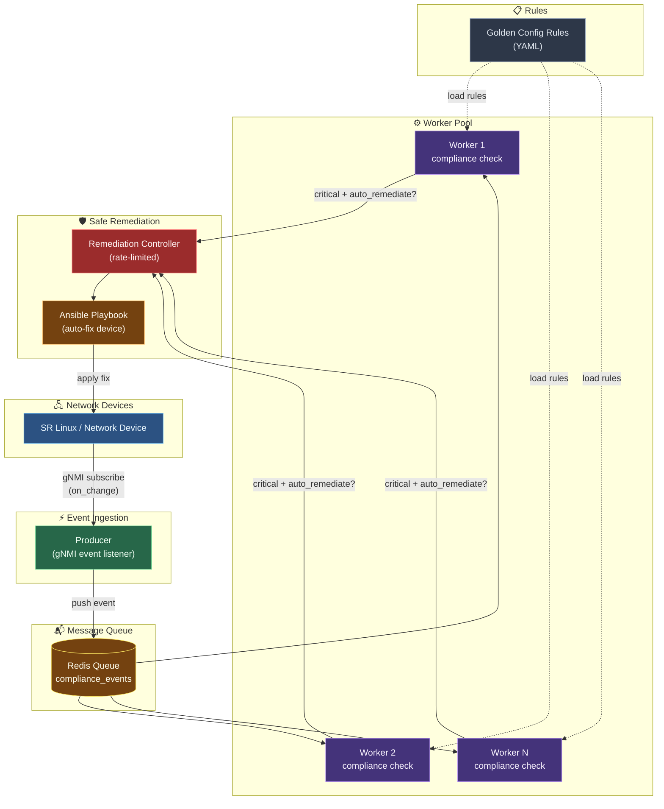

# 🛡️ network-compliance

**Automated network configuration compliance & drift detection — from scheduled checks to an event-driven, queue-backed, rate-limited auto-remediation pipeline.**

Stop finding out about a misconfigured router from an auditor. `network-compliance` continuously watches your network devices, flags any drift from your security baseline, and — for the changes you trust it with — fixes them automatically, safely, and with a paper trail.

[](https://hub.docker.com/r/tronghvan/network-compliance)
[](LICENSE)
[](https://www.python.org/)
[](https://kubernetes.io/)

---

## 🎯 The Problem

Banks and large enterprises run hundreds to thousands of network devices. An engineer SSHes in, makes a "temporary" fix, forgets to revert it — and six months later that config drift is the reason a PCI-DSS audit fails, or worse, the reason an intrusion went undetected. Checking hundreds of devices by hand isn't a process, it's a hope.

`network-compliance` turns your security baseline into code, and continuously proves — with evidence, not guesswork — that your network still matches it.

## ✨ Key Features

- 🔌 **Nokia SR Linux** via gNMI out of the box; Netmiko/Ansible path left extensible for Cisco / Juniper / Arista
- ⚡ **Event-driven detection** over gNMI `subscribe` — sub-second drift detection instead of waiting for the next poll cycle
- 🧵 **Concurrent polling engine** with a benchmarked, tunable worker pool (measured 4x speedup on 60-device load test)
- 📨 **Redis-backed job queue** — decouples "listening" from "processing" so a burst of 500 simultaneous config changes never overwhelms your workers
- 📜 **Rules-as-data** — compliance policies live in versioned YAML with ownership metadata and per-device-group targeting, not buried in Python
- 🤖 **Guarded auto-remediation** via Ansible — only rules explicitly marked safe are auto-fixed, with a hard rate-limit to prevent a "remediation storm"
- 📊 **Prometheus-native metrics** — events processed, failures, and processing latency, exposed per worker out of the box
- 🐳 **Container-first** — Docker image, Kubernetes CronJob, and a Helm chart for multi-environment (dev/prod) rollout
- 🚀 **CI/CD included** — GitHub Actions pipeline builds, pushes, and deploys on every commit

## 🏗️ Architecture / How It Works

```
## Architecture / How It Works



> 📷 *`docs/architecture-diagram.png` — full diagram with metrics/K8s layer to be added here.*

The whole pipeline ships as a Docker image, runs as a **Kubernetes CronJob** (via the included Helm chart) for scheduled polling, and the event-driven listener/worker processes run as long-lived Deployments for real-time detection.

## 🚀 Quick Start

### 1. Pull the image

```bash
docker pull tronghvan/network-compliance:latest
```

### 2. Prepare your inventory and rules

```bash
mkdir -p compliance-config/rules
cp your-inventory.yml compliance-config/inventory.yml
cp your-rules/*.yml compliance-config/rules/
```

### 3. Run a one-shot compliance check

```bash
docker run --rm \
  -v $(pwd)/compliance-config:/app/config \
  -e INVENTORY_PATH=/app/config/inventory.yml \
  -e RULES_DIR=/app/config/rules \
  tronghvan/network-compliance:latest
```

| Flag | Purpose |
|---|---|
| `-v $(pwd)/compliance-config:/app/config` | Mounts your device inventory and rule definitions into the container — no rebuild needed to change targets |
| `-e INVENTORY_PATH` | Path (inside the container) to your device inventory file |
| `-e RULES_DIR` | Path (inside the container) to the directory of rule YAML files |

Exit code `0` means fully compliant; non-zero means a violation was found **or** a device was unreachable — the tool never silently reports "OK" when it couldn't actually check something.

### 4. Run it on a schedule with Kubernetes + Helm

```bash
helm install compliance-prod ./network-compliance-chart \
  --set image.tag=latest \
  --set schedule="*/15 * * * *"
```

## ⚙️ Configuration

### `inventory.yml`

```yaml
devices:
  - name: core-router-01
    host: 10.0.0.1
    username: admin
    password: "${DEVICE_PASSWORD}"
    device_type: nokia_srl
    group: core-routers
```

### `rules/logging-siem.yml`

```yaml
metadata:
  rule_id: "SEC-001"
  name: "Remote syslog must point to the approved SIEM"
  created_by: "security-team"
  version: 2
  applies_to:
    device_group: "core-routers"

check:
  mode: ["polling", "event"]
  polling:
    check_string: "remote-server 10.0.0.100"
  event:
    path_contains: "remote-server"
    expected_value_contains: "10.0.0.100"

severity: critical
auto_remediate: true
```

| Field | Description |
|---|---|
| `applies_to.device_group` | Rule only evaluated against devices tagged with a matching `group` in the inventory |
| `check.mode` | Supports both scheduled polling and real-time event-driven checks with a single rule definition |
| `auto_remediate` | Must be explicitly `true` for the remediation controller to ever touch this device automatically |

## 🗺️ Roadmap

- [x] Concurrent polling with benchmarked worker pool
- [x] gNMI event-driven subscription
- [x] Redis-backed job queue for burst handling
- [x] Rule metadata, versioning, and device-group targeting
- [x] Prometheus metrics per worker
- [x] Rate-limited auto-remediation guardrails
- [ ] Multi-vendor rule packs (Cisco IOS-XE, Juniper Junos)
- [ ] Web dashboard for compliance history and drift trends
- [ ] Slack/Teams alerting on critical drift
- [ ] Canary remediation rollout (fix N devices, verify, then proceed)
- [ ] OpenTelemetry tracing across producer → queue → worker → remediation

Have an idea? [Open an issue](../../issues) — contributions to the roadmap are very welcome.

## 🤝 Contributing

Contributions, bug reports, and feature requests are welcome!

1. Fork the repo
2. Create your feature branch (`git checkout -b feature/amazing-rule`)
3. Commit your changes (`git commit -m 'Add support for Juniper Junos'`)
4. Push to the branch (`git push origin feature/amazing-rule`)
5. Open a Pull Request

Please open an issue first for major changes so we can discuss the approach.

## 📄 License

Distributed under the MIT License. See [`LICENSE`](LICENSE) for full text.

---

### 🏷️ Suggested GitHub Topics

```
network-automation  compliance-as-code  netdevops  gnmi  ansible-automation
kubernetes  network-security  configuration-drift
```
